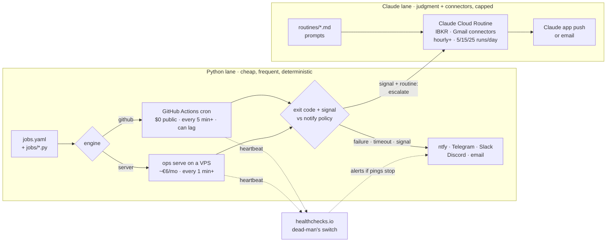

# ops: scheduled Python jobs + Claude routines, with notifications

One registry ([`jobs.yaml`](jobs.yaml)) says **what** runs, **when**, **where** and
**when to tell you**. Engines execute it; one notification layer reports back. Git is the
control plane: edit, push, done.

**Abbreviations:** VPS = virtual private server (a rented always-on Linux machine) ·
IBKR = Interactive Brokers · CI = continuous integration · cron = the 5-field schedule
syntax `minute hour day-of-month month day-of-week` · ET = US Eastern Time.

## Process map



The loop that makes it worth having: **cheap, frequent Python checks** (free on GitHub)
decide *whether* something happened; only then does an **expensive Claude routine** run to
work out *what it means*. Routine runs are capped per day, and the checks are not.

## Which engine for which job

| | GitHub Actions (`engine: github`) | Server (`engine: server`) | Claude Cloud Routine | Headless Claude (`type: claude`) |
|---|---|---|---|---|
| Cost | $0 on public repos; private: 2,000 min/month free, then $0.006/min | Hetzner CX23 €5.49/month + IPv4 | your Claude plan's usage | your plan's usage (OAuth token) or API tokens |
| Shortest schedule | 5 min | 1 min | 1 hour | same as its engine |
| Timing | can start late; worst at minute 0; queued runs can be dropped | on the minute | on-the-hour runs can start several minutes late | same as its engine |
| Max run time | 6 h | none | one session | same as its engine |
| claude.ai connectors (IBKR, Gmail…) | no | no | **yes** | **no**: the token can only make model requests |
| Daily cap | none | none | Pro 5 · Max 15 · Team/Enterprise 25 runs | none beyond plan usage limits |
| You maintain | nothing | OS updates, disk, uptime | nothing | nothing |
| Silent failure mode | public repos: schedule disabled after 60 days without repository activity; forks start with schedules disabled | machine dies | daily cap hit, routine paused | expired token (1-year life) |

Pick a VPS only when a job needs one of: under 5-minute cadence, minute-accurate timing,
runs over 6 h, a long-lived process (e.g. IBKR's IB Gateway for its trading API), a fixed
IP, or data you don't want on GitHub.

Sources (checked 2026-09-29): GitHub [schedule event](https://docs.github.com/en/actions/reference/workflows-and-actions/events-that-trigger-workflows#schedule),
[Actions billing](https://docs.github.com/en/billing/concepts/product-billing/github-actions),
[forks](https://docs.github.com/actions/managing-workflow-runs/disabling-and-enabling-a-workflow);
Claude [routines](https://code.claude.com/docs/en/routines),
[routine API](https://platform.claude.com/docs/en/api/claude-code/routines-fire),
[setup-token](https://code.claude.com/docs/en/authentication#generate-a-long-lived-token),
[routine caps](https://claude.com/blog/introducing-routines-in-claude-code);
[ntfy limits](https://docs.ntfy.sh/publish/#limitations);
[Hetzner CX23](https://costgoat.com/pricing/hetzner).

## Quick start (GitHub engine, about 15 minutes)

1. **Pick a notification channel** and add its values as repository secrets
   (Settings → Secrets and variables → Actions). Names are in
   [`deploy/.env.example`](deploy/.env.example).
   - *ntfy* (fastest): install the ntfy app, subscribe to a long random topic, e.g. from
     `python -c "import secrets; print('ops-' + secrets.token_urlsafe(18))"`, and add
     secret `NTFY_TOPIC`. On ntfy.sh the topic name is the only access control; the free
     tier allows 250 messages/day.
   - *Telegram* (private to your chat): create a bot with @BotFather, message it once, read
     your chat id from `https://api.telegram.org/bot<TOKEN>/getUpdates`, and add
     `TELEGRAM_BOT_TOKEN` and `TELEGRAM_CHAT_ID`.
2. **Merge to the default branch** (`master`). GitHub runs schedules only from there.
3. **Enable Actions.** This repo is a fork, and GitHub disables scheduled workflows on
   forks by default. In the Actions tab, enable workflows, then enable `ops-scheduler`.
4. **Test end to end:** Actions → ops-scheduler → Run workflow → job `ping`. Your phone
   should buzz. If it doesn't, the run fails (red) and GitHub emails you.
5. **Add a dead-man's switch:** create a free check at healthchecks.io with period 6 h and
   grace 1 h, then add its ping URL as secret `HEARTBEAT_URL`. It alerts you if the
   `heartbeat` job stops running, which the scheduler itself cannot report.

Local use is the same with an `automation/.env` file (gitignored):

```bash
cd automation
pip install -r requirements.txt
cp deploy/.env.example .env      # fill in one channel
python -m ops notify-test        # prove the channel works
python -m ops list               # jobs, schedules, next run times
```

## Add a job

1. Copy [`jobs/_template.py`](jobs/_template.py). Exit non-zero on failure; call
   `signal("...")` (write to `$OPS_NOTIFY`) when you want to be told something.
2. Register it in `jobs.yaml`: `name`, `run`, `schedule`, `notify`, and `secrets` for any
   keys it needs (a job receives only the secrets it lists).
3. Try it: `python -m ops run my-job --dry-run` prints the notification instead of sending.
4. `python -m ops sync` regenerates `.github/workflows/ops-scheduler.yml`. Commit both
   files; CI (`ops-ci`) fails if they disagree.

Notify policies: `always` · `signal` (only when the job signals) · `failure` · `never`.
Failures and timeouts notify under every policy except `never`.

## Claude

**Cloud Routines**: when the job needs your connectors (live IBKR data, Gmail). Prompts
live in [`routines/`](routines/); setup and limits are in [routines/README.md](routines/README.md).
They notify through the Claude app.

**Headless Claude** (`type: claude` in `jobs.yaml`): runs `claude -p` on GitHub or your
server. Use it for web research, or to interpret output your Python produced. It does not
count against the routine daily cap. Set up:

1. Run `claude setup-token` on your machine and add the token as secret
   `CLAUDE_CODE_OAUTH_TOKEN`. It uses your subscription, lasts one year, and cannot load
   connectors. An `ANTHROPIC_API_KEY` works too; it is billed per token and runs in the
   faster `--bare` mode.
2. Scope it: `allowed_tools`, `max_turns`, and `max_budget_usd`, which caps Claude Code's
   client-side cost estimate. Runs use `--permission-mode dontAsk`, so anything not allowed
   is denied, never prompted.
3. With `notify: signal`, Claude is told to reply `NOTHING_TO_REPORT` when there is nothing
   worth a notification.

**Bridge (job → routine)**: add `routine: deep_dive` to a job. When the job signals, ops
starts the routine through its API trigger with the signal text. Secrets:
`ROUTINE_DEEP_DIVE_URL` and `ROUTINE_DEEP_DIVE_TOKEN`. The API has no idempotency key, so
ops never retries a fire.

## Server engine (VPS)

Move a job with `engine: server` (or change `defaults.engine`), run `sync`, and push. The
`self-update` job pulls every 15 minutes, and the server reloads `jobs.yaml` when it changes.
Each job has exactly one engine, so nothing runs twice.

**Docker** (any host with Docker installed):

```bash
git clone https://github.com/VinnieCooks/sandbox.git && cd sandbox
cp automation/deploy/.env.example automation/.env   # fill in channels + OPS_HEARTBEAT_URL
cd automation/deploy && docker compose up -d --build && docker compose logs -f
```

**systemd** (no Docker): clone to `/opt/ops`, create `/opt/ops/.venv`, run
`pip install -r automation/requirements.txt`, then install
[`deploy/ops.service`](deploy/ops.service).

Set `OPS_HEARTBEAT_URL` (a second healthchecks.io check, period 5 min). The server pings
it every 5 minutes, so you hear about it if the machine goes down.

## Security

- **This repository is a public fork.** Anyone can read its Actions logs, and forks cannot
  be made private. The workflow therefore keeps job output out of logs
  (`OPS_REDACT_LOGS=1`); output goes only to your notification channel. Before automating
  anything with account data (positions, balances), move `automation/` and
  `.github/workflows/ops-*.yml` to a new **private** repository. GitHub Free includes
  2,000 Actions minutes/month there; a 6-hourly heartbeat uses about 120.
- **Secrets:** repository secrets reach the runner as `OPS_SECRETS_JSON`; each job gets
  only what it lists under `secrets:`. The workflow has read-only permissions and does not
  keep the git token (`persist-credentials: false`).
- **Channels:** ntfy.sh topics are protected only by being hard to guess; Telegram bot chats
  are private to you. Neither is end-to-end encrypted.
- **Routines with connectors:** include only the connectors a routine needs. A routine can
  call any tool of an included connector, IBKR order tools included, without asking.

## What tells you when something breaks

| Failure | Who tells you |
|---|---|
| Job fails or times out | ops, on your channel (all policies except `never`) |
| Notification channel broken, e.g. a revoked token | the run fails and GitHub emails you about the failed run |
| GitHub delays, drops, or disables the schedule | `heartbeat` stops pinging, and healthchecks.io alerts you |
| VPS dies | `OPS_HEARTBEAT_URL` stops, and healthchecks.io alerts you |
| Routine blocked by its daily cap, or paused | the routine's run list; for API fires, the job's notification says why |

## Commands

Run from `automation/` as `python -m ops <command>`:

| Command | Does |
|---|---|
| `list` | jobs, schedules, next run times, warnings |
| `run NAME [--dry-run]` | run one job now (disabled jobs too) and notify per its policy |
| `run-scheduled --cron EXPR` | what the GitHub workflow calls: runs the jobs using that cron |
| `serve` | the server engine loop |
| `sync` / `check` | regenerate / verify the GitHub workflow |
| `channels` / `notify-test` | show configured channels / send a test message |
| `fire-routine NAME [--text ...]` | start a Cloud Routine through its API trigger |

Tests: `pip install -r requirements-dev.txt && python -m pytest -q`.
